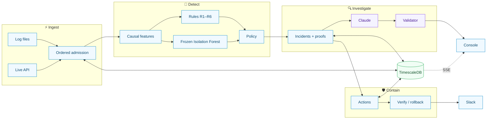
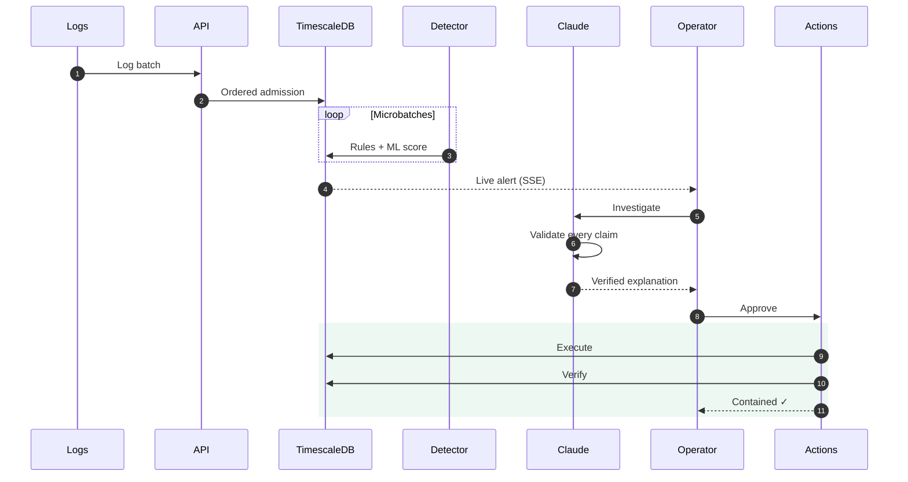

# WatchTower

**Detection → investigation → containment in one loop. An AI security analyst that can't make things up.**

WatchTower ingests raw HTTP access logs, catches attacks as they unfold, assembles
them into provable incidents, and takes an operator from the first alert to a
verified, reversible fix without leaving the console.

Most security tools stop at "here's an alert." WatchTower closes the loop:

- **Detect.** Every event is scored causally: only the past is visible, never the
  future. Six deterministic rules run alongside an Isolation Forest trained on
  history-relative behavior, and neither signal is trusted alone.
- **Correlate.** Alerts collapse into versioned incidents built from typed facts,
  and each fact is backed by a proof that points at exact log lines.
- **Investigate.** Claude reads the evidence and proposes hypotheses. A validator
  checks every claim against the facts, and anything fabricated is rejected before it
  reaches the screen.
- **Contain.** Playbooks compile into containment actions with targets bound by code,
  not by the model. Dry-run it, approve it, execute it, verify it against live
  traffic, and roll it back.

The model never touches ground truth. Pull the AI out entirely and the system keeps
working.

## By the numbers

| | |
|---|---|
| **180,800** | log lines ingested across 8 months at **~7,000 lines/sec**, with zero parse failures |
| **22,982 → 3** | a month of traffic reduced to 3 incidents worth an analyst's time |
| **26×** | faster event paging (81 ms → 3 ms) |
| **2×** | faster analytics on TimescaleDB continuous aggregates, bit-identical to raw queries |
| **100%** | deterministic replay: runs are hashed by config, dataset and model |
| **0** | message brokers. Postgres is the event store, job queue and outbox (`SKIP LOCKED`) |
| **187** | backend tests plus real-browser Playwright gates on every PR |

**Built on a time-series engine.** Events are stored in TimescaleDB hypertables,
automatically partitioned by time, so queries only touch the chunks they need.
Dashboards read from continuous aggregates that roll up in the background, and hot
paths are indexed so they avoid wasted joins. Event pages return in **~3 ms**. There is no
Kafka, no Redis and no separate queue to scale. One database does it all.

## System Architecture

<!-- Replace with the rendered image once exported. -->



## Sequence Diagram

<!-- Replace with the rendered image once exported. -->



## Project Planning

The [overview](overview.md), [architecture](architecture.md) and [plan](plan.md)
describe the component boundaries, failure handling, evaluation approach and the
completion criteria for each stage.

## Local setup

WatchTower requires Python 3.12, Node 20+ and Docker.

```bash
cp .env.example .env
python -m venv .venv && source .venv/bin/activate
pip install -r requirements.txt
cd frontend && npm ci && cd ..
python tasks.py db-up
python tasks.py migrate
python tasks.py import DATASET_PATH=./htn_challenge_logs_2026.txt
python tasks.py dev
```

Open `http://127.0.0.1:5173`. The API runs on `:8000`, alongside the detector and
side-effect workers.

To replay the demo, which warms on August–February history and pauses at March 1:

```bash
python tasks.py replay-demo
```

Open the run, set a replay speed and press **Resume**. March surfaces three
incidents: an unfamiliar-source login attack, an admin role change, and confidential
file access after 77 prior denials.

To train and activate the model:

```bash
python tasks.py train
python -m ml.calibrate --model-id <id> --percentile 99.9 --activate
python -m ml.evaluate --model-id <id>
```

Slack, Sentry and the AI investigator (Claude) are optional. Without keys they run
in preview or deterministic mode. Detection thresholds, playbooks and actions live
in `config/*.yaml`.

## Deployment

A single `Dockerfile` builds the API, the console and the workers.
`railway.json` and `railway.worker.json` configure Railway. The only external
dependency is TimescaleDB, either self-hosted or on Tiger Cloud.

```bash
docker compose --profile app up --build
```

## Checks

Continuous integration runs two gates on every push and pull request:

```bash
python tasks.py verify-frontend  # typecheck, lint, build, Playwright browser tests
python tasks.py verify-backend   # full pytest suite against a real TimescaleDB
```

Each gate saves a human-readable report to `reports/verification/`. To run both
locally:

```bash
python tasks.py verify
```
