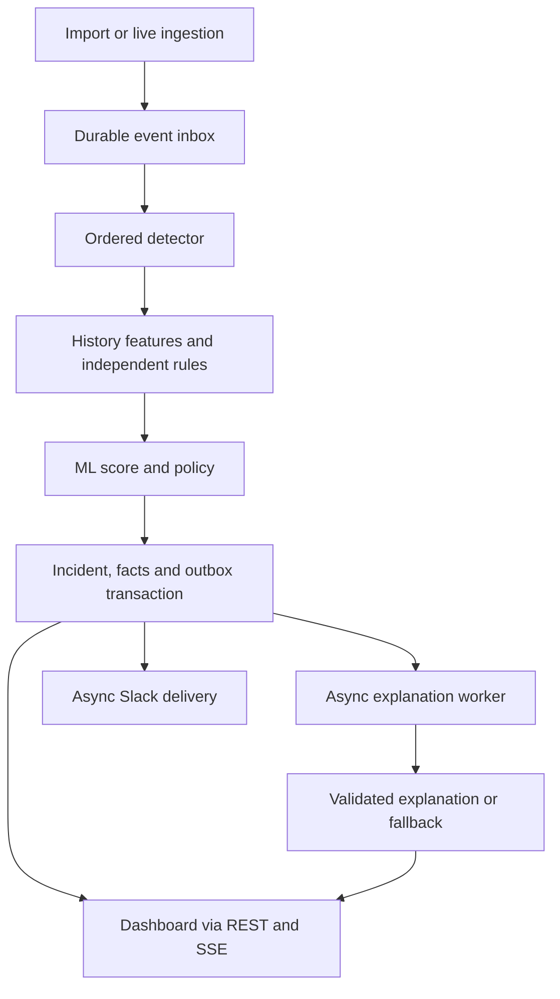

# Log & Order — architecture and implementation contracts

**Version 1.0.** Read `overview.md` for rationale and evidence, then `plan.md` for execution. MUST denotes a release requirement. Defaults below are initial engineering choices, not experimentally validated performance or accuracy claims. Changes require a short decision note and regression evidence.

## 1. Runtime structure

Use Python 3.12+, FastAPI, Pydantic, SQLAlchemy/Alembic and psycopg; scikit-learn for ML. React/TypeScript/Vite is the default UI. Keep an existing Next.js app if it already works; FastAPI still owns processing. Pin compatible dependency versions and the local TimescaleDB image after a smoke test; do not assume an unverified latest version is compatible with Tiger Cloud.

Deploy one codebase as three processes: API, ordered detector, and asynchronous side-effect worker. One Postgres/TimescaleDB database is the only durable dependency. No in-process FastAPI background task is a durability mechanism. No Redis/Kafka requirement.



Instrument every process with Sentry Tracing and Logs. Observability failure cannot roll back a detection. External network calls never occur inside detector transactions.

## 2. Invariants

1. Original source evidence is immutable and addressable by dataset hash and line number.
2. A detection run owns its state, ordering, model, thresholds, incidents, jobs and notifications. Reset creates a new run; it never truncates shared evidence.
3. Before event k is scored, historical features use only committed run events with sequence < k. Current-event fields are separate inputs. After commit, evidence can include k.
4. Future raw records may exist in storage but cannot appear in live queries, tools, exports or baselines until the run has processed them.
5. Score/rule decision, baseline update, run cursor, incident changes, durable UI update and new outbox entries commit atomically.
6. Invalid, late, pending and failed-to-process records are not labeled normal.
7. ML and rules execute independently. Neither a low model score nor LLM reassurance vetoes a rule.
8. No claimed exact-once Slack delivery. Database retries are idempotent; external delivery can be ambiguous.
9. Every published fact has deterministic provenance. AI-generated hypotheses remain qualified and cannot authorize operational changes.
10. Critical detection remains usable without LLM, Slack or Sentry availability. Without the database, ingestion returns failure and does not acknowledge durability.

## 3. Canonical evidence, ordering and ingestion

Parse the observed format strictly, preserve `raw_line`, and split request path/query without decoding away forensic evidence. Store raw target, decoded inspection form and query-key list separately; one bounded decode pass, no recursive decoding. Route normalization replaces numeric object IDs for modeling only; retain exact path and object ID for links. Preserve HTTP version and raw IP text. Normalize timestamps to UTC while retaining original timestamp text and offset minutes. Do not reinterpret every -0400 offset using a named region's daylight-saving rules.

File event ID: SHA-256 of dataset digest plus delimiter plus one-based line number. Identical-looking lines at different offsets remain distinct. File identity is the raw file SHA-256. Live event identity: authenticated source_id + client-supplied event_id; same ID/same payload is duplicate success, same ID/different payload is conflict. Store a canonical payload hash.

Raw import and processing are different operations: load and validate source records once, then create runs referencing them. Import jobs checkpoint line/byte progress and counts. A dataset is ready only after its content hash and counts are complete. Invalid rows enter a rejects table with line number/reason; no silent drops. The supplied file should have zero rejects.

Replay admits records in `(event_time, original_line_number)` order and assigns contiguous run_seq numbers. Its controller durably records admission progress and mode; pause stops admission, then lets the detector drain already admitted work. A short queue cap (default 1,000 records) prevents pause from appearing ineffective. Warmup fast-forwards through the same state updater without alerts/LLM calls. Default visible evaluation begins March 1, 2026 after earlier history is warmed.

For live input, the MVP contract is a single ordered source per run: admission serializes on the run row, sorts each accepted batch by `(event_time, client_order)`, and requires timestamp >= the last admitted timestamp. Equal timestamps use admission order. Earlier records are durably recorded as `late`, excluded from live scoring, and counted visibly. An explicit retrospective run may later process them in sorted order; never silently rewrite old live verdicts. This bounded scope is more reliable than an incomplete watermark/retraction system. Multi-source reordering is deferred.

Every endpoint and tool requires run_id. No user-controlled arbitrary file path or arbitrary SQL endpoint. File uploads stream to a configured server directory with size limits; the local import CLI may use DATASET_PATH.

## 4. Storage model

Ordinary PostgreSQL tables unless explicitly marked. Use UUID/text IDs and bigint counters. All run-owned tables include run_id in relevant unique keys. Define actual migrations and indexes before UI work.

| Table | Required columns and uniqueness |
|---|---|
| datasets | id, content_sha256 UNIQUE, original_name, bytes, total/valid/rejected counts, parse_version, import_state |
| event_registry | event_id PK, dataset_id/line_number or source_id/client_event_id, payload_hash, event_time; UNIQUE(dataset_id,line_number) and UNIQUE(source_id,client_event_id) where applicable |
| raw_events — hypertable on event_time | event_time, event_id, ip_raw, username, method, http_version, raw_target, path, route_family, object_id, query_keys, status, response_bytes, raw_line, original_time, offset_minutes; PK(event_time,event_id) |
| ingestion_rejects | source/dataset identifiers, line/request index, raw bounded input, reason, received_at |
| models | model_id PK, feature_version, artifact_hash/path, training cutoff, calibration cutoff, reference hash, threshold, calibration score artifact, dependency versions, status |
| runs | run_id PK, dataset/source, mode, phase, model_id, config_hash, admitted_seq, processed_seq, last_admitted_time, virtual_time, state, model_health |
| run_events | run_id, run_seq, event_id, event_time, phase, processing_state, attempts/error; PK(run_id,run_seq), UNIQUE(run_id,event_id) |
| entity_stats | run_id, typed key, count/state JSON with schema version; PK(run_id,key_type,key_value) |
| feature_snapshots | run_id, run_seq, event_id, feature_version, history_count, numeric_vector, observed_context, reference_hash; PK(run_id,run_seq) |
| detections | run_id, run_seq, threat_class nullable, processing_status, model_id, model_score nullable, anomaly_percentile nullable, reason_codes, rule_ids; PK(run_id,run_seq) |
| processed_events — hypertable on event_time | run_id, run_seq, event_time, account/IP, status, bytes, class, phase; PK(event_time,run_id,run_seq); write only in detector commit |
| incidents / incident_versions | identity, status; immutable versions with class, trigger_seq, timeline bounds, facts, evidence strength and rule IDs; UNIQUE(run_id,incident_id,version) |
| incident_evidence / incident_relations | typed event memberships and rule-created links; UNIQUE(run_id,incident_id,event_id,relation_type) |
| fact_packets | run_id, incident_id, version, cutoff_seq, packet_hash, facts JSON, completeness flags; UNIQUE(run_id,incident_id,version) |
| explanation_jobs / explanations | incident version, packet hash, model/prompt version, state, lease, attempts, proposed selections, validated result, rejection reasons |
| notification_outbox | run/incident/version, notification_kind, destination key, payload, idempotency key UNIQUE, state, lease, attempts, retry time |
| ui_updates | run_id, update_seq, type, minimal payload, committed_at; PK(run_id,update_seq); allocate update_seq under run lock |
| analyst_feedback | run/incident/version, authenticated reviewer, disposition/reason/time; append-only |

Registry provides global deduplication because hypertable unique keys include partition time. Insert registry + raw event atomically; compare hashes on conflicts. No dependence on an unsupported global unique event_id index on a hypertable.

Indexes: raw_events(username,event_time), raw_events(ip_raw,event_time), raw_events(path,event_time); run_events(run_id,event_time,run_seq); run_events(run_id,processing_state,run_seq); pending jobs/outbox by state/retry time; entity_stats primary key. Add others only after query plans identify a need.

### Tiger analytics

Create one continuous aggregate over `processed_events`: 5-minute bucket, run_id, account, count, 401/403 counts, response bytes and high-risk count. It contains only committed processed records, never the future imported raw dataset. Refresh actual historical replay ranges explicitly. Wall-clock refresh windows alone will miss 2025/2026 demo data.

Use aggregates for the current run's historical dashboard, not model features or pinned historical fact packets. Query complete materialized buckets plus a non-overlapping raw tail; show refresh watermark and fallback to raw if necessary. Historical/as-of views use indexed raw processed records with run_seq cutoff, because an aggregate can include events processed after that view's cutoff. Reset isolates data by a new run_id.

Benchmark identical results and measured latency with raw GROUP BY versus aggregate. Do not promise compression or speedups. [Tiger real-time aggregate documentation](https://www.tigerdata.com/docs/use-timescale/latest/continuous-aggregates/real-time-aggregates/) should be checked against the deployed extension version; explicitly configure freshness rather than depending on defaults.

## 5. Detector transaction and recovery

One detector owns a run at a time, enforced by locking its runs row. For the MVP use one detector process; the lock prevents accidental second-owner corruption.

For each event (or a small ordered microbatch inside one transaction): lock run; read the next contiguous run_seq; read prior stats and bounded history; compute features; score if model available; run independent rules; apply classification; update/relate incidents; materialize deterministic facts and pending jobs; persist detection and processed_events; update stats; advance cursor and ui_updates; commit. If transaction fails, no cursor/state/effects advance. On retry, keys prevent duplicate records. Rules use prior evidence plus the explicit current event.

All state needed for correctness lives in SQL. Use bounded indexed queries for 5-minute/1-hour/72-hour histories and persistent account/pair counters for all-history counts. Do not start with a second mutable in-memory state engine. Optimization may add read-through caches later only with parity and restart tests.

If deterministic event processing throws, retry a bounded number of times, then pause the run as blocked at that sequence; do not skip it and claim full processing. If model loading/inference fails, rules may continue with `model_health=degraded`, null score and visible rules-only status; do not pretend these are fully modeled normal decisions. A local startup check catches artifact/version mismatch before replay.

Asynchronous jobs claim ready rows with short `FOR UPDATE SKIP LOCKED` transactions, set lease owner/expiry, commit, call the provider, then persist outcome only if the lease is still owned. Expired leases are reclaimable. Scope this pattern to unordered side-effect jobs, not ordered detection. PostgreSQL documents SKIP LOCKED as suitable for queue-like access, not a consistent analytical view. [PostgreSQL SELECT documentation](https://www.postgresql.org/docs/current/sql-select.html)

## 6. Historical features and model lifecycle

Maintain two concepts: observed history (all earlier valid events, not assumed benign) and frozen familiar-source reference (bootstrap history, not a permission list). Repeated failed attempts must never turn an IP into a familiar successful-login source.

Chronological protocol, using dates at the source's recorded -0400 offset:
- August: bootstrap observed history and familiar-source reference; model warmup only.
- September–December: generate causal feature vectors and fit the first model.
- January–February: calibrate threshold and review sampled alerts; no model refit on March.
- March: visible evaluation/replay with frozen model and threshold; historical counters continue to update.

Freeze familiar-source reference from August successful login 200s: a pair is familiar after >=3 such events across >=2 recorded dates. Low-support accounts get `reference_unknown`, not “compromised.” This is observed familiarity, not trusted authorization. Changes in legitimate behavior may create false positives; reviewed retraining updates this reference in a new artifact/run. Long-term observed frequency features keep updating causally; all-history evidence counters remain available even after suspicious activity. The learned model itself stays frozen.

For new datasets, dates become explicit configuration; require nonempty chronological bootstrap/train/calibration/evaluation partitions, or use a clearly labeled rules-only mode. Never random-split logs or generate fake labels.

### Feature vector v1

Counts below exclude the current event; current attributes use the event itself. Trailing window is `[event_time - duration, event_time]` over processed seq < k, so equal-timestamp preceding records are included. Missing denominators use smoothing/unknown indicators, never NaN. Keep one ordered schema shared by train and inference.

| Feature group | Definition |
|---|---|
| Recent volume | log1p(account requests in 5m); log1p(IP requests in 5m); log1p(account requests in 1h) |
| Authentication | log1p(401 login count for account/IP pair in 5m); pair failed-login ratio `(failures+1)/(login_attempts+2)` |
| Familiarity | pair absent from frozen successful-login reference; reference_unknown indicator; observed pair rarity `-log((pair_count+1)/(account_count+distinct_IPs+1))` |
| Resource history | observed account/route-family rarity with Laplace smoothing; log1p(account/exact-path denial count); first-200-after-denials boolean |
| Request characteristics | login/admin/forum/sensitive-resource indicators from versioned route config; status-family indicator; unusual query-key count relative to bootstrap route family |
| Size | log1p(response_bytes); delta from bootstrap median log1p(bytes) for same route family + status, with fallback and missing-reference indicator |
| Timing | local hour sine/cosine; weekend indicator; smoothed account/hour rarity from prior observed history |
| Evidence maturity | log1p(account history count); cold_start (fewer than 50 previous account events) |

No numeric encoding of username/IP identity as continuous quantities. No raw URL text embedding. Sensitive-resource matching (`CONFIDENTIAL` and reviewed route patterns) is a heuristic flag, not ground-truth classification. Training normalization/medians must use only bootstrap/training data, never evaluation data. Current feature deviations explain measured context, not causal model importance.

Start with IsolationForest(n_estimators=200, max_samples='auto', contamination='auto', random_state=42), cap worker CPU use explicitly. Fit one pooled model. Define anomaly score as `-score_samples(X)` so higher means more anomalous; calibrate a separate policy threshold rather than using default predict() output. Persist the empirical calibration distribution for a rarity percentile. Never display that percentile as attack confidence. [Isolation Forest API](https://scikit-learn.org/stable/modules/generated/sklearn.ensemble.IsolationForest.html)

Default candidate threshold: 99.5th calibration percentile. Compare 99, 99.5 and 99.9 on calibration alert burden and reviewed examples, document the chosen value before March evaluation. Report ties and use `score > threshold`. If a model floods alerts or adds no value, keep rules active and demote the model to visibly marked shadow mode. Do not force arbitrary ensemble weights.

Artifact manifest: model ID, file SHA-256, feature/config versions and order, bootstrap/train/calibration time ranges, reference hash, random seed, dependencies, threshold, calibration scores and evaluation notes. Only load artifacts generated by this project from configured paths; never unpickle an uploaded model file.

## 7. Independent rules and incident correlation

Classification precedence: high-risk rule > suspicious rule or model threshold > normal. `processing_status` and `model_health` are separate. All thresholds below live in versioned config; calibrate with benign examples and do not encode specific account names, IPs, dates or post IDs.

| Rule | Predicate | Outcome |
|---|---|---|
| R1 auth burst | Current event is login 401; current plus prior pair failures >=4 in 60s, and pair is unfamiliar or account reference unknown | Suspicious; stable episode anchored to account/IP |
| R2 access change | Current GET returns 200 for sensitive exact path; prior account/path 403 count >=5 and prior 200 count=0 | Suspicious; measured change, not automatic proof of unauthorized access |
| R3 admin transition | Current configured admin POST returns 2xx, account has no previous success on this endpoint, and same account viewed a forum object within 60s | Suspicious; link exact forum view and admin request, not a causal assertion |
| R4 account-use sequence | Sensitive GET 200 from unfamiliar pair, successful login 200 for same pair within 30m, and R1 episode for same pair within 72h | High risk; suspected account misuse |
| R5 linked access-change sequence | R2 now fires for account A; within preceding 60m another account B viewed object O then satisfied R3; A also viewed O within 60m before B's view | High risk; unusual access change with linked forum/admin context |

Generic parameter/query anomalies and ML can add suspicious context, but the words csrf/script/success alone cannot establish exploit execution. R5 never asserts who created O or whose role was changed. No successful login event proves a real session identity because session IDs are absent. Rules use these as recorded request sequences only.

For each rule match, persist event IDs for every required leg and the predicate parameters. Correlate within 72 hours using typed keys: account/IP pair, account/exact-resource, or shared forum-object link. Time proximity alone is insufficient. Common static assets and shared subnets do not connect incidents.

Group repeat alerts of the same rule and typed key into one incident while inside its correlation window. A new rule can attach to that incident only through an explicit shared account/pair/resource/object link. If two episodes already exist, retain their identities and add a relation; do not recursively union every connected component into a giant incident. UI can show related episodes together. Class increases automatically; lowering/closing requires recorded analyst disposition. Preserve original event verdicts when later evidence escalates an incident.

Limits: inspect at most 200 relevant raw events per packet; query precise qualifying joins/counts independently so a display cap cannot make a rule false. If result limits prevent completing a predicate, mark evaluation incomplete and surface it, never treat missing data as proof of safety.

## 8. Evidence and AI contract

The strongest reliability choice is to generate the factual case before calling an LLM. Code creates an immutable packet for an incident version/cutoff_seq. Every fact has fact_id, predicate kind, exact arguments, value, time/cursor cutoff, evidence references or aggregate-query definition/version, and a provenance hash. Examples: event status/path match, counted prior denials, source familiarity, time difference, same-object relation. UI renders these facts through deterministic templates.

Large aggregates need not list 77 events in the prompt: include the computed count and query identity; the evidence viewer can page through all matches under the same cutoff. Exact known counts and historical sample sizes are never calculated by the LLM.

Bounded AI investigation can call parameterized tools: account_history, pair_auth_history, resource_history, related_object_events and playbook_catalog. Backend owns run_id/cutoff and injects them; the model cannot override them. Max 6 calls, 200 returned event rows total, 8,000 input tokens, 1,200 output tokens, 15s total deadline per attempt, at most one repair within a 30s job budget. These are configurable ceilings. Counters/aggregate facts remain available if event listings truncate. One configured LLM provider; no runtime provider fallback chain in v1.

LLM returns only structured selections:

```json
{
  "schema_version": "1",
  "packet_hash": "provided-packet-hash",
  "summary_fact_ids": ["fact-1", "fact-2"],
  "hypotheses": [{
    "type": "possible_account_misuse",
    "supporting_fact_ids": ["fact-1"],
    "counterevidence_fact_ids": [],
    "unknown_codes": ["session_identity_unavailable"]
  }],
  "false_positive_assessment": {
    "status": "insufficient_evidence",
    "supporting_fact_ids": [],
    "missing_evidence_codes": ["authorized_change_record"]
  },
  "playbook_ids": ["review_account_activity"]
}
```

Allowed hypothesis codes: possible_account_misuse, possible_privilege_abuse, possible_forum_mediated_request, legitimate_authorized_activity, insufficient_evidence. Map each to reviewed qualified text and minimum fact predicates. Do not offer “confirmed CSRF,” “stolen credentials” or “external exfiltration” templates for this dataset. New factual prose is not published from the LLM. This sacrifices free-form fluency to make validation tractable. An internal raw proposal may be retained for debugging without appearing as verified content.

Validator checks schema, packet/version hash, membership, code-specific supporting predicates, fact cutoffs, playbook applicability, conflicting selections and immutable inclusion of all high-risk trigger facts. Counterevidence is retrieved by deterministic code as well, so the LLM cannot omit it to make the case look stronger. Facts the AI elects not to summarize remain visible in the evidence panel.

On timeout/refusal/invalid output: one repair at most, then deterministic summary + “AI review unavailable.” Cache validated output by packet/prompt/model hash. Late output for an obsolete incident version remains archived and cannot overwrite current explanation. LLM false-positive assessment is advisory and never suppresses delivery. No arbitrary SQL, browsing, shell execution, operational credentials or webhook access in model tools.

Escape log text in the UI, delimiter-wrap it for prompts, redact credentials if encountered, and treat all embedded text as untrusted instructions. Citation validation does not prove truth of arbitrary prose; the typed-fact contract is what avoids that gap. Missing observability data remains a limitation, not something the LLM can repair.

## 9. Slack and remediation

Notification payloads are deterministic: incident/version, class, account/IP, observed timestamps, two or three trigger facts and a configured application link. Do not wait for AI to send a high-risk alert. The channel/webhook is supplied through server environment, never in a tool or log payload.

Default SLACK_MODE=preview. Explicitly configured live delivery uses a durable outbox. Suspicious initial alerts are grouped with a 5-minute event-time debounce for replay and 5-minute wall time for live; flush final pending digests at replay completion. High-risk first escalation bypasses this debounce. Repeated evidence at the same severity appears in the app; send another Slack message only for a defined material escalation, not every event. Replay runs are preview-only unless an operator explicitly opts one run into a test destination; guard total messages per run.

Retry transport/5xx failures with jitter (base 2s, cap 60s, max 5 attempts). Honor 429 Retry-After even beyond that cap. Permanent 4xx configuration failures stop and surface failed state. Lease expiry/timeouts after remote acceptance can cause duplicate delivery; incident/version label makes it recognizable. One active sender per destination with a default <=1 message/second cap, adjusted to provider response. Persist next_attempt_at; never block the worker with sleeps. Incoming webhooks do not provide exactly-once delivery or general update/delete behavior. [Slack incoming webhook documentation](https://docs.slack.dev/messaging/sending-messages-using-incoming-webhooks/)

Analyst actions remain in the app; Slack buttons point to authenticated app views. No Slack interaction workflow is required.

Playbook catalog is reviewed YAML/JSON: id, applicability predicates, uncertainty, required evidence, proposed steps, permissions, impact, verification and rollback. Include account/session review, role/audit review, forum content and request-protection review, and sensitive-access authorization review. Recommendations do not fabricate the missing production stack or exact vulnerable code. Optional remediation demo uses local simulated session/role state, explicit operator action and undo; never claim to patch CSE's system.

## 10. API, UI and security boundaries

Versioned REST contract; OpenAPI drives frontend types. Default limits: <=1,000 events or 2 MiB per live batch, <=64 KiB per record, <=200 rows/page, bounded query time ranges; tune only from measurements. Return per-item accepted/duplicate/rejected/late/conflict state. Request counts must add up. Unavailable DB: non-2xx response, no false acceptance.

| Endpoint | Contract |
|---|---|
| POST /api/v1/datasets | Multipart upload -> 202 import job ID; no arbitrary filesystem paths |
| GET /api/v1/datasets/{id} | Import progress, counts, hash, rejects |
| POST /api/v1/runs | Dataset/source, configured model and start boundary -> isolated run |
| POST /api/v1/runs/{id}/events | Authenticated live batch with idempotent source event IDs |
| POST /api/v1/runs/{id}/replay | start/pause/resume plus capped speed; reset is new-run creation |
| GET /api/v1/runs/{id} | Cursor, phase, backlog, integration and model health |
| GET /api/v1/runs/{id}/events | Cursor-paginated processed evidence under run cutoff |
| GET /api/v1/runs/{id}/incidents | Paginated incident summaries and filters |
| GET /api/v1/runs/{id}/incidents/{incident} | Versioned facts, timeline, related episodes, explanation and delivery status |
| GET /api/v1/runs/{id}/facts/{fact} | Exact evidence or paginated recomputable aggregate proof |
| POST /api/v1/runs/{id}/incidents/{incident}/feedback | Reviewer, disposition, reason; authenticated append-only audit |
| GET /api/v1/runs/{id}/updates | SSE with Last-Event-ID from durable ui_updates |
| GET /health/live and /health/ready | Process liveness; DB/model readiness with declared degraded modes |

SSE resumes from run-scoped update_seq; heartbeat about every 15s. Updates are batched/coalesced, not 180,800 rendered DOM rows. Retain update history for a whole demo run. If a cursor is expired, send resync_required and fetch a snapshot. SSE endpoint must not hold a detector transaction. Polling fallback every 2s is acceptable if the hosting proxy blocks streaming.

Bind local demo to loopback by default. For shared/public deployment, require authenticated operator access to raw logs and mutations, an ingestion token, fixed CORS origins and TLS. Use same-origin API proxy/session for EventSource rather than secrets in query strings. Do not add a full multi-tenant identity product. Escape all evidence text; never render arbitrary query contents as HTML. External links derive from trusted APP_BASE_URL.

## 11. Sentry and operational evidence

Tracing plus Logs are required from the first working slice. Spans: ingest, persist, features, model.score, rules.evaluate, correlate, facts.build, explanation.call, explanation.validate, notify.deliver. Propagate trace context through job records; start asynchronous transactions linked to originating context where supported. Use opaque run/incident IDs as correlation keys, not usernames, raw URLs, webhook URLs or raw prompts by default.

Structured events: parse_rejected, event_late, run_blocked, model_degraded, claim_rejected, explanation_timeout, notification_failed, aggregate_stale. Track queue age, detector lag, model/feature versions, alert counts, validation rejection reasons and provider latency. Sampling may be 100% for the bounded demo; production sampling is a later tuning decision.

Sentry is not a hallucination detector or ground-truth service. Record the application's validation outcomes and use traces to fix real bottlenecks. Keep evidence of a measured before/after query change, plus a labeled invalid-claim injection test. Installing the SDK alone is not completion. Consult [Sentry Python Tracing](https://docs.sentry.io/platforms/python/tracing/) and [Sentry Python Logs](https://docs.sentry.io/platforms/python/logs/) at implementation time for the pinned SDK.

## 12. Failure semantics and boundaries

| Failure | Required behavior |
|---|---|
| DB unavailable | Reject unpersisted ingestion; UI unavailable/degraded, never a fabricated healthy feed |
| Detector crash before commit | Replay next sequence on restart, no partial facts or baseline increment |
| Detector crash after commit | Cursor and effects already present, no duplicate processing |
| Model incompatible/unavailable | Visible rules-only mode, null ML scores; full release requires tested model integration |
| Invalid deterministic event computation | Bounded retry then blocked run with evidence preserved |
| LLM fails or returns injected/fabricated selections | Reject; deterministic explanation stays usable |
| Slack unavailable | Durable retries and visible delivery state; detector continues |
| Sentry unavailable | Local diagnostics, detector continues |
| Aggregate stale | Raw scoped-query fallback; no change to detector semantics |
| SSE disconnect | Durable resume or snapshot resync |
| Late input | Persist separately, visibly exclude from live inference; optional new retrospective run |
| Replay repeated | New isolated run; no prior-state contamination or automatic real notifications |

This is a reliable bounded prototype, not a claim of production SOC coverage. Deployment scaling, multi-source watermarks, identity attribution, authorization ground truth and real containment integrations need additional work and telemetry.
