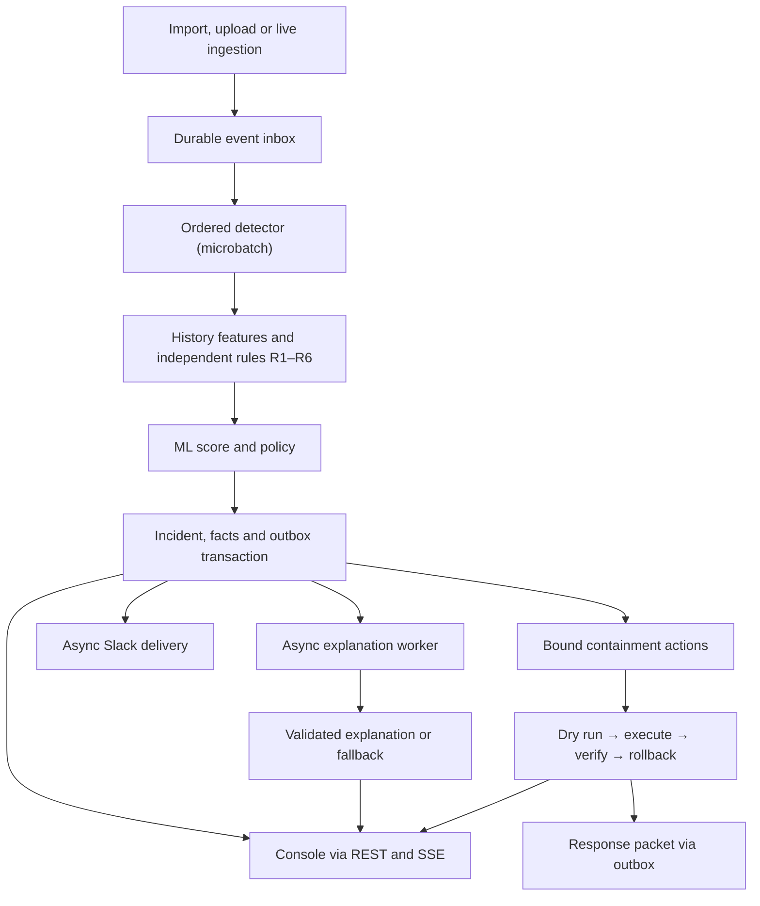

# WatchTower — architecture and implementation contracts

**Version 1.1, 2026-09-21.** Read `overview.md` for rationale and evidence, then `plan.md` for execution. MUST denotes a release requirement. Defaults below are initial engineering choices, not experimentally validated performance or accuracy claims. Changes require a short decision note (recorded in `PROGRESS.md`) and regression evidence.

**Changes since 1.0:** R6 slow authentication rule (§7); containment actions and response packets (§10); model preprocessing stage, full-partition fit, default-model attachment and the support-novelty channel (§6); microbatched detector writes and poison-record isolation (§5); durable dataset upload handoff and two-role deployment (§1, §3); added tables and indexes (§4); operator/ingest authentication and the expanded endpoint list (§11).

## 1. Runtime structure

Use Python 3.12+, FastAPI, Pydantic, SQLAlchemy/Alembic and psycopg; scikit-learn for ML. The console is React + TypeScript + Vite. FastAPI owns all processing. Dependency versions and the TimescaleDB image are pinned (local: PostgreSQL 17 / TimescaleDB 2.30); do not assume an unverified latest version is compatible with Tiger Cloud.

One codebase, one container image, three logical processes: API, ordered detector, and asynchronous side-effect worker (explanations, Slack delivery, aggregate refresh, upload import). The image runs in two roles:

- `scripts.serve_api` — FastAPI plus the built console, mounted last so API routes always win and an unknown `/api/*` path stays a JSON 404.
- `scripts.serve_worker` — detector and side-effect loops as two threads; `WORKER_ROLES` splits them across services. SIGTERM drains.

One-off CLIs (`import_dataset`, `migrate`, `replay_demo`, `contain_incident`, …) use the same image. One Postgres/TimescaleDB database is the only durable dependency. No Redis, Kafka or object storage: queues are tables with `SKIP LOCKED` leases, the model is a CPU scikit-learn artifact. No in-process FastAPI background task is a durability mechanism. Hosted target: Railway (`Dockerfile`, `railway.json`, `railway.worker.json`) with Tiger Cloud or `timescaledb-ha:pg17`.



Instrument every process with Sentry Tracing and Logs. Observability failure cannot roll back a detection. External network calls never occur inside detector transactions.

## 2. Invariants

1. Original source evidence is immutable and addressable by dataset hash and line number.
2. A detection run owns its state, ordering, model, thresholds, incidents, jobs, actions and notifications. Reset creates a new run; it never truncates shared evidence.
3. Before event k is scored, historical features use only committed run events with sequence < k. Current-event fields are separate inputs. After commit, evidence can include k.
4. Future raw records may exist in storage but cannot appear in live queries, tools, exports, verifications or baselines until the run has processed them.
5. Score/rule decision, baseline update, run cursor, incident changes, durable UI update and new outbox entries commit atomically.
6. Invalid, late, pending and failed-to-process records are not labeled normal.
7. ML and rules execute independently. Neither a low model score nor LLM reassurance vetoes a rule.
8. No claimed exact-once Slack or action-webhook delivery. Database retries are idempotent; external delivery can be ambiguous.
9. Every published fact has deterministic provenance. AI-generated hypotheses remain qualified and cannot authorize operational changes.
10. Critical detection remains usable without LLM, Slack or Sentry availability. Without the database, ingestion returns failure and does not acknowledge durability.
11. The AI never supplies an action parameter. Every containment parameter is bound by code from the incident row or a typed fact, and keeps that fact as provenance. Execution is preview unless an operator configures live mode.

## 3. Canonical evidence, ordering and ingestion

Parse the observed format strictly, preserve `raw_line`, and split request path/query without decoding away forensic evidence. Store raw target, decoded inspection form and query-key list separately; one bounded decode pass, no recursive decoding. Route normalization replaces numeric object IDs for modeling only; retain exact path and object ID for links. Preserve HTTP version and raw IP text (`10.0.9.05` survives). Normalize timestamps to UTC while retaining original timestamp text and offset minutes. Do not reinterpret every -0400 offset using a named region's daylight-saving rules.

File event ID: SHA-256 of dataset digest plus delimiter plus one-based line number. Identical-looking lines at different offsets remain distinct. File identity is the raw file SHA-256. Live event identity: authenticated source_id + client-supplied event_id; same ID/same payload is duplicate success, same ID/different payload is conflict — including duplicates inside one batch. Store a canonical payload hash.

Raw import and processing are different operations: load and validate source records once, then create runs referencing them. Import jobs checkpoint line/byte progress and counts and run `ANALYZE` before the final registry/raw join. A dataset is ready only after its content hash and counts are complete. Invalid rows — including invalid UTF-8, NUL bytes and out-of-range byte counts — enter a rejects table with line number/reason; no silent drops and no aborted import. The supplied file has zero rejects.

Uploads (`POST /api/v1/datasets`) are streamed with size limits into `dataset_uploads` (bytea) in the same transaction as the dataset row, so a separately deployed worker imports them without a shared filesystem. A `failed` upload is requeued. The local import CLI may use DATASET_PATH. No user-controlled arbitrary file path or arbitrary SQL endpoint.

Replay admits records in `(event_time, original_line_number)` order and assigns contiguous run_seq numbers. Its controller durably records admission progress, mode, speed and virtual time; pause stops admission, then lets the detector drain already admitted work. A queue cap (default 1,000 records) keeps pause effective. Speed 0 means unbounded fast-forward; `max_speed` bounds the rest. Virtual time starts at `max(visible_start, range_start)`. Warmup fast-forwards through the same state updater without alerts/LLM calls. Default visible evaluation begins March 1, 2026 after earlier history is warmed.

For live input, the MVP contract is a single ordered source per run: admission serializes on the run row, sorts each accepted batch by `(event_time, client_order)`, and requires timestamp >= the last admitted timestamp. Equal timestamps use admission order. Earlier records are durably recorded in `run_late_events`, excluded from live scoring, and counted visibly. An explicit retrospective run may later process them in sorted order; never silently rewrite old live verdicts. Live runs start in the `visible` phase. Multi-source reordering is deferred.

Every run-scoped endpoint and tool requires run_id.

## 4. Storage model

Ordinary PostgreSQL tables unless explicitly marked. Hand-written SQL inside Alembic revisions `0001`–`0006`. Use UUID/text IDs and bigint counters. All run-owned tables include run_id in relevant unique keys.

| Table | Required columns and uniqueness |
|---|---|
| datasets | id, content_sha256 UNIQUE, original_name, bytes, total/valid/rejected counts, parse_version, import_state |
| dataset_uploads | dataset_id PK → datasets, content bytea, created_at; upload handoff between API and worker |
| event_registry | event_id PK, dataset_id/line_number or source_id/client_event_id, payload_hash, event_time; UNIQUE(dataset_id,line_number) and UNIQUE(source_id,client_event_id) where applicable |
| raw_events — hypertable on event_time | event_time, event_id, ip_raw, username, method, http_version, raw_target, path, route_family, object_id, query_keys, status, response_bytes, raw_line, original_time, offset_minutes; PK(event_time,event_id) |
| ingestion_rejects | source/dataset identifiers, line/request index, raw bounded input, reason, received_at |
| models | model_id PK, feature_version, artifact_hash/path, training cutoff, calibration cutoff, reference hash, feature_config_hash, threshold, calibration score artifact, dependency versions, status (candidate/active/shadow/rejected) |
| runs | run_id PK, dataset/source, mode, phase, model_id, config_hash, admitted_seq, processed_seq, last_admitted_time, virtual_time, speed, state, model_health |
| run_events | run_id, run_seq, event_id, event_time, phase, processing_state, attempts/error; PK(run_id,run_seq), UNIQUE(run_id,event_id) |
| run_late_events | late live records kept outside the ordered inbox, with reason and received time |
| entity_stats | run_id, typed key, count/state JSON with schema version; PK(run_id,key_type,key_value) |
| feature_snapshots | run_id, run_seq, event_id, feature_version, history_count, numeric_vector, observed_context, reference_hash; PK(run_id,run_seq) |
| detections | run_id, run_seq, threat_class nullable, processing_status, model_id, model_health, model_score nullable, anomaly_percentile nullable, model_flagged, reason_codes, rule_ids, top_deviations; PK(run_id,run_seq) |
| processed_events — hypertable on event_time | run_id, run_seq, event_time, account/IP, path, route_family, status, bytes, class, phase; PK(event_time,run_id,run_seq); write only in detector commit |
| rule_matches | run_id, run_seq, rule_id, outcome, typed key, legs (event IDs per role), predicate params, incomplete flag |
| incidents / incident_versions | identity, status, contained_at, containment_mode (preview/applied); immutable versions with class, trigger_seq, timeline bounds, facts, evidence strength and rule IDs; UNIQUE(run_id,incident_id,version) |
| incident_evidence / incident_relations | typed event memberships and rule-created links with created_seq and origin_incident_id provenance; UNIQUE(run_id,incident_id,event_id,relation_type) |
| fact_packets | run_id, incident_id, version, cutoff_seq, packet_hash, facts JSON, completeness flags; UNIQUE(run_id,incident_id,version) |
| explanation_jobs / explanations | incident version, packet hash, model/prompt version, state (validated/rejected/fallback), lease, attempts, proposed selections, validated result, rejection reasons |
| notification_outbox | run/incident/version, notification_kind (alert/digest/response_packet), destination key, payload, idempotency key UNIQUE, state, lease, attempts, retry time |
| ui_updates | run_id, update_seq, type, minimal payload, committed_at; PK(run_id,update_seq); allocate update_seq under run row lock in every writer |
| analyst_feedback | run/incident/version, authenticated reviewer, disposition/reason/time; append-only |
| action_proposals | run/incident, action_id, bound params + provenance, params_hash pinned at dry run, state, verification result |
| action_log | append-only per phase (dry_run/execute/verify/rollback): operator, adapter, exact request, result, time |
| response_packets | run/incident/version, Markdown body, sha256, fact packet hash, created_at |
| aggregate_refreshes | run_id, refreshed range, watermark, refreshed_at |

Registry provides global deduplication because hypertable unique keys include partition time. Insert registry + raw event atomically; compare hashes on conflicts. No dependence on an unsupported global unique event_id index on a hypertable.

Indexes: raw_events(username,event_time), raw_events(ip_raw,event_time), raw_events(path,event_time); event_registry(dataset_id,event_time,line_number) for replay admission; processed_events(run_id,username,path,event_time); run_events(run_id,event_time,run_seq); run_events(run_id,processing_state,run_seq); pending jobs/outbox by state/retry time; entity_stats primary key. Add others only after query plans identify a need.

### Tiger analytics

One continuous aggregate `processed_events_5m` over `processed_events`: 5-minute bucket, run_id, account, count, 401/403 counts, response bytes and high-risk count; `materialized_only`, refreshed explicitly over actual replay ranges and recorded in `aggregate_refreshes`. The side-effect worker refreshes stale runs at most every 30 s. It contains only committed processed records, never the future imported raw dataset. Wall-clock refresh windows alone would miss 2025/2026 demo data.

Use the aggregate for the current run's historical dashboard (server-side roll-up to 5m/60m/1d, optional per-account grouping), not model features or pinned historical fact packets. Query complete materialized buckets plus a non-overlapping raw tail; show the refresh watermark and fall back to raw when never refreshed. Historical/as-of views use indexed raw processed records with run_seq cutoff. Reset isolates data by a new run_id.

`GET …/analytics/benchmark` compares raw GROUP BY with the aggregate for identical results and measured latency. Do not promise compression or speedups beyond recorded measurements (`reports/performance.md`). [Tiger real-time aggregate documentation](https://www.tigerdata.com/docs/use-timescale/latest/continuous-aggregates/real-time-aggregates/) should be checked against the deployed extension version.

## 5. Detector transaction and recovery

One detector owns a run at a time, enforced by locking its runs row. Use one detector process; the lock prevents accidental second-owner corruption.

The detector processes an ordered microbatch (default 200 events) inside one transaction: lock run; read the next contiguous run_seq values; for each event read prior stats and bounded history, compute features, score if a model is available, run independent rules, apply classification, update/relate incidents and materialize deterministic facts and pending jobs; buffer feature_snapshots, detections and run_events updates and flush them once per microbatch with `executemany`; persist processed_events per event so later events in the same batch see it; flush stats; advance cursor and ui_updates; commit. If the transaction fails, no cursor/state/effects advance. On retry, keys prevent duplicate records. Rules use prior evidence plus the explicit current event.

All state needed for correctness lives in SQL. Use bounded indexed queries for 60s/5-minute/1-hour/72-hour histories and persistent account/pair counters for all-history counts. Any in-memory replay state (e.g. a window-count cache under the replay-speed work) must pass a differential test against the SQL original before it replaces a query.

If deterministic event processing throws, the failing record is identified by its own run_seq, the healthy prefix of the microbatch commits, the record is retried a bounded number of times (`max_attempts: 3`), then the run is paused as blocked at that sequence; never skip it and claim full processing. `model_health` is reconciled every batch. If model loading/inference fails, rules continue with `model_health=degraded` (or `rules_only` when no compatible model exists), null score and visible status; do not pretend these are fully modeled normal decisions. A startup check catches artifact/version/hash mismatch before replay.

Asynchronous jobs claim ready rows with short `FOR UPDATE SKIP LOCKED` transactions, set lease owner/expiry, commit, call the provider, then persist outcome only if the lease is still owned. Expired leases are reclaimable. Scope this pattern to unordered side-effect jobs, not ordered detection. [PostgreSQL SELECT documentation](https://www.postgresql.org/docs/current/sql-select.html)

## 6. Historical features and model lifecycle

Maintain two concepts: observed history (all earlier valid events, not assumed benign) and frozen familiar-source reference (bootstrap history, not a permission list). Repeated failed attempts must never turn an IP into a familiar successful-login source.

Chronological protocol (`config/partitions.yaml`), using dates at the source's recorded -0400 offset:
- August: bootstrap observed history and familiar-source reference; model warmup only.
- September–December: generate causal feature vectors and fit the model.
- January–February: calibrate threshold and review sampled alerts; no model refit on March.
- March: visible evaluation/replay with frozen model and threshold; historical counters continue to update.

Freeze familiar-source reference from August successful login 200s: a pair is familiar after >=3 such events across >=2 recorded dates. Low-support accounts get `reference_unknown`, not “compromised.” This is observed familiarity, not trusted authorization. Reviewed retraining updates this reference in a new artifact/run. The learned model stays frozen per run.

For new datasets, dates become explicit configuration; require nonempty chronological bootstrap/train/calibration/evaluation partitions, or use a clearly labeled rules-only mode. Never random-split logs or generate fake labels.

### Feature vector v1

Counts below exclude the current event; current attributes use the event itself. Trailing window is `[event_time - duration, event_time]` over processed seq < k, so equal-timestamp preceding records are included. Missing denominators use smoothing/unknown indicators, never NaN. One ordered 30-feature schema is shared by train and inference.

| Feature group | Definition |
|---|---|
| Recent volume | log1p(account requests in 5m); log1p(IP requests in 5m); log1p(account requests in 1h) |
| Authentication | log1p(401 login count for account/IP pair in 5m); pair failed-login ratio `(failures+1)/(login_attempts+2)` |
| Familiarity | pair absent from frozen successful-login reference; reference_unknown indicator; observed pair rarity `-log((pair_count+1)/(account_count+distinct_IPs+1))` |
| Resource history | observed account/route-family rarity with Laplace smoothing; log1p(account/exact-path denial count); first-200-after-denials boolean |
| Request characteristics | login/admin/forum/sensitive-resource indicators from versioned route config; status-family indicator; unusual query-key count relative to bootstrap route family |
| Size | log1p(response_bytes); delta from bootstrap median log1p(bytes) for same route family + status, with fallback and missing-reference indicator |
| Timing | local hour sine/cosine; weekend indicator; smoothed account/hour rarity from prior observed history |
| Evidence maturity | log1p(account history count); cold_start (fewer than 50 previous account events) |

No numeric encoding of username/IP identity as continuous quantities. No raw URL text embedding. Sensitive-resource matching (`CONFIDENTIAL` and reviewed route patterns) is a heuristic flag, not ground-truth classification. Training normalization/medians use only bootstrap/training data. Current feature deviations (`top_deviations`) explain measured context, not causal model importance. Known redundancy: account and IP 5-minute volume are identical on this corpus; dropping one requires a feature-version bump.

### Model

A pickled scikit-learn `Pipeline`: preprocessing stage `domain_v1` (`app/detection/preprocess.py`), then IsolationForest(n_estimators=200, max_samples=1.0, contamination='auto', random_state=42, n_jobs=1). The preprocessing stage is fitted on the training partition only; it prunes features that are constant in training (the forest can never split on them; 8 of 30 on this corpus) and adds a flat penalty per never-seen value on those features, so a vector with zero training support always outranks an in-domain one (`reports/preprocessing.md`). `max_samples=1.0` replaces `auto` (256 rows/tree), which almost never sampled rare-but-varying features. Anomaly score is `-score_samples(X)`, higher means more anomalous. Persist the empirical calibration distribution for a rarity percentile; never display that percentile as attack confidence. [Isolation Forest API](https://scikit-learn.org/stable/modules/generated/sklearn.ensemble.IsolationForest.html)

Threshold: compare the 99, 99.5 and 99.9 calibration percentiles on alert burden and reviewed examples; the active model uses 99.9, frozen before March evaluation. Use `score > threshold`. A model-only flag marks the event `suspicious` in the feed with its measured deviations but creates no incident and no Slack message; only rules create incidents. If a model floods alerts or adds no value, keep rules active and demote it to visibly marked shadow mode (scored, never classifies). No forced ensemble weights.

Every new run attaches the newest `active` model unless one is pinned; there is no rules-only opt-out. The model must match the run's familiarity reference hash and `feature_config_hash` (policy `features` + routes); otherwise the run is `rules_only`. An unloadable artifact degrades to rules-only instead of blocking. `--activate` demotes the previous active model.

Artifact manifest: model ID, file SHA-256, feature/config versions and order, preprocessing declaration, bootstrap/train/calibration time ranges, reference hash, random seed, dependencies, threshold, calibration scores and evaluation notes; written before the DB registration commits. Only load artifacts generated by this project from configured paths; never unpickle an uploaded model file. `ml/artifacts/` is not committed, so a fresh deployment is rules-only until an artifact is supplied.

### Support-novelty channel (implemented, not yet wired)

`app/detection/novelty.py` scores bounded dimensions (training cardinality <= 4, i.e. the indicators) by whether the value ever occurred in training, weight `log(n+2)` per never-seen value; the score decomposes per feature, so each alert carries its explanation. Unbounded counters are excluded because they drift out of range and would fire on everything. The envelope is fitted on training only and frozen with the artifact. It is thresholded independently of the density channel and neither vetoes the other. Status: unit-tested and evaluated offline (`docs/ml-experimentation/README.md`); it is **not** yet called by the detector or `ml/train.py`. Until it is, product claims must not describe it as live.

## 7. Independent rules and incident correlation

Classification precedence: high-risk rule > suspicious rule or model threshold > normal. `processing_status` and `model_health` are separate. All thresholds below live in versioned `config/policy.yaml`; calibrate with benign examples and do not encode specific account names, IPs, dates or post IDs.

| Rule | Predicate | Outcome |
|---|---|---|
| R1 auth burst | Current event is login 401; current plus prior pair failures >=4 in 60s, and pair is unfamiliar or account reference unknown | Suspicious; stable episode anchored to account/IP |
| R6 slow auth burst | Current event is login 401 that does not satisfy R1; current plus prior pair failures >=6 in 1h, pair unfamiliar or reference unknown | Suspicious; never duplicates R1's fast-burst evidence |
| R2 access change | Current GET returns 200 for sensitive exact path; prior account/path 403 count >=5 and prior 200 count=0 | Suspicious; measured change, not automatic proof of unauthorized access |
| R3 admin transition | Current configured admin POST returns 2xx, account has no previous success on this endpoint, and same account viewed a forum object within 60s | Suspicious; link exact forum view and admin request, not a causal assertion |
| R4 account-use sequence | Sensitive GET 200 from unfamiliar pair, successful login 200 for same pair within 30m, and R1 or R6 episode for same pair within 72h | High risk; suspected account misuse |
| R5 linked access-change sequence | R2 now fires for account A; within preceding 60m another account B viewed object O then satisfied R3; A also viewed O within 60m before B's view | High risk; unusual access change with linked forum/admin context |

Generic parameter/query anomalies and ML can add suspicious context, but the words csrf/script/success alone cannot establish exploit execution. R5 never asserts who created O or whose role was changed. No successful login event proves a real session identity because session IDs are absent. Rules use these as recorded request sequences only.

For each rule match, persist a `rule_matches` row with event IDs for every required leg and the predicate parameters. Correlate within 72 hours using typed keys: account/IP pair, account/exact-resource, or shared forum-object link. Time proximity alone is insufficient. Common static assets and shared subnets do not connect incidents.

Group repeat alerts of the same rule and typed key into one incident while inside its correlation window. A new rule can attach to that incident only through an explicit shared account/pair/resource/object link. If two episodes already exist, retain their identities and add a relation recording `created_seq` and origin incident, so as-of views never show a relation created after their cutoff. Do not recursively union connected components into a giant incident. Class increases automatically and an escalating rule reopens a closed incident; the headline follows the highest-outcome rule. Lowering/closing requires a recorded analyst disposition. Preserve original event verdicts when later evidence escalates an incident.

Limits: inspect at most 200 relevant raw events per packet; query precise qualifying joins/counts independently so a display cap cannot make a rule false. If result limits prevent completing a predicate, mark evaluation incomplete and surface it, never treat missing data as proof of safety.

## 8. Evidence and AI contract

Generate the factual case before calling an LLM. Code creates an immutable packet for an incident version/cutoff_seq. Every fact has fact_id, predicate kind, exact arguments, value, time/cursor cutoff, evidence references or aggregate-query definition/version, and a provenance hash. UI renders these facts through deterministic templates, and each incident version exports as a local investigation brief (`docs/case-brief.md`) with no AI proposals or mutable operational state.

Large aggregates need not list 77 events in the prompt: include the computed count and query identity; the evidence viewer can page through all matches under the same cutoff. Exact known counts and historical sample sizes are never calculated by the LLM.

Bounded AI investigation can call parameterized read-only tools: account_history, pair_auth_history, resource_history, related_object_events and playbook_catalog. Backend owns run_id/cutoff and injects them; the model cannot override them. Max 6 calls, 200 returned event rows total, 8,000 input tokens, 1,200 output tokens, 15s per attempt, at most one repair within a 30s job budget, and a job attempt ceiling after which the deterministic fallback is final. One configured provider (default Anthropic `claude-opus-5` through the official SDK, strict client tools, a `submit_selections` tool); the assistant turn echoes the provider's full content, including thinking blocks, on tool and repair rounds. No runtime provider fallback chain.

LLM returns only structured selections:

```json
{
  "schema_version": "1",
  "packet_hash": "provided-packet-hash",
  "summary_fact_ids": ["fact-1", "fact-2"],
  "hypotheses": [{
    "type": "possible_account_misuse",
    "supporting_fact_ids": ["fact-1"],
    "counterevidence_fact_ids": [],
    "unknown_codes": ["session_identity_unavailable"]
  }],
  "false_positive_assessment": {
    "status": "insufficient_evidence",
    "supporting_fact_ids": [],
    "missing_evidence_codes": ["authorized_change_record"]
  },
  "playbook_ids": ["review_account_activity"]
}
```

Allowed hypothesis codes: possible_account_misuse, possible_privilege_abuse, possible_forum_mediated_request, legitimate_authorized_activity, insufficient_evidence. Map each to reviewed qualified text and minimum fact predicates; always-present context facts cannot satisfy a hypothesis gate. Do not offer “confirmed CSRF,” “stolen credentials” or “external exfiltration” templates for this dataset. New factual prose is not published from the LLM.

Validator checks schema, packet/version hash, membership, code-specific supporting predicates, fact cutoffs, playbook applicability, conflicting selections and immutable inclusion of all high-risk trigger facts. Counterevidence is retrieved by deterministic code as well. Facts the AI elects not to summarize remain visible in the evidence panel.

On timeout/refusal/invalid output: one repair at most, then deterministic summary + “AI review unavailable.” A validator rejection is stored as `rejected` (with reasons), distinct from provider `fallback`. Cache validated output by packet/prompt/model hash. The stale-version guard is re-checked under lock when a result is persisted; late output for an obsolete version is archived and cannot overwrite the current explanation. LLM false-positive assessment is advisory and never suppresses delivery. No arbitrary SQL, browsing, shell execution, operational credentials or webhook access in model tools. `scripts.inject_invalid_claim` is the labeled fault-injection path.

Escape log text in the UI, delimiter-wrap it for prompts, redact credentials if encountered, and treat all embedded text as untrusted instructions.

## 9. Slack delivery

Notification payloads are deterministic: incident/version, class, account/IP, observed timestamps, two or three trigger facts and a configured application link. Do not wait for AI to send a high-risk alert. The webhook is supplied through server environment, never in a tool or log payload.

Default SLACK_MODE=preview (rendered and stored, nothing sent). Explicitly configured live delivery uses the durable outbox. Suspicious initial alerts are grouped with a 5-minute event-time debounce for replay and 5-minute wall time for live (live digests are promoted on idle detector steps); flush final pending digests at replay completion. High-risk first escalation bypasses the debounce. Send another message only for a defined material escalation. Replay runs are preview-only unless an operator opts one run into a test destination; `MAX_RUN_NOTIFICATION_COUNT` caps it.

Retry transport/5xx failures with jitter (base 2s, cap 60s, max 5 attempts). Honor 429 Retry-After even beyond that cap. Permanent 4xx configuration failures stop and surface failed state. Lease expiry/timeouts after remote acceptance can cause duplicate delivery; the incident/version label makes it recognizable. One active sender per destination at <=1 message/second by default. Persist next_attempt_at; never block the worker with sleeps. [Slack incoming webhook documentation](https://docs.slack.dev/messaging/sending-messages-using-incoming-webhooks/)

Analyst actions remain in the app; Slack links point to authenticated app views. No Slack interaction workflow (Block Kit buttons would need an interactive app, not a webhook).

## 10. Playbooks, containment actions and response packets

Playbook catalog (`config/playbooks.yaml`) is reviewed content: id, applicability predicates, uncertainty, required evidence, proposed steps, permissions, impact, verification and rollback. Recommendations do not fabricate the missing production stack or exact vulnerable code; never claim to patch CSE's system.

`config/actions.yaml` maps playbook steps to typed actions (`revoke_sessions`, `force_credential_reset`, `block_source`, `restore_acl`, `revert_role_change`, `quarantine_object`, `export_response_packet`). The catalog is validated at load: binding sources, precondition arguments, verification ids and their parameters.

- **Binding** (`actions/binding.py`): every parameter comes from the incident row or a typed fact (`fact:<kind>.args.<key>`, `fact:<kind>.value`, optional `split`), with the fact id kept as provenance. A missing fact makes the action unavailable with the reason; never partially bound.
- **Preconditions** (`incident_status_open`, `rule_any`, `fact_present`, `fact_value_in`) are evaluated by code, shown as checks, and re-evaluated at execute time.
- **Sequencing** (`actions/service.py`): dry run → execute → verify → rollback. Typed 409 refusals: `dry_run_required`, `already_executed`, `binding_changed` (params_hash pinned at dry run no longer matches), `preconditions_unmet`, `not_executed`, `not_reversible`. A `failed` execute needs a fresh dry run. Every phase appends to `action_log` before state moves; every write takes the run row lock before emitting a UI update.
- **Adapters** mirror Slack: `PreviewAdapter` (default, `applied_to_external_system: false`) and `WebhookAdapter` when `ACTION_MODE=live` + `ACTION_WEBHOOK_URL`, POSTing the object the dry run displayed. Incidents are stamped `contained_at` + `containment_mode ∈ {preview, applied}`; rollback recomputes the mode and clears the stamp when no action remains.
- **Verification** (`actions/verify.py`): named SQL identities over `processed_events` under the run cutoff (`success_on_path_after`, `events_from_source_after`, `auth_success_for_pair_after`, `account_activity_after`, `object_access_after`, `admin_post_2xx_after`), measured from the approval cutoff recorded on the execute log row. Results: `satisfied` / `contradicted` / `pending`. In a replay the log is fixed, so `contradicted` means recorded activity continued past the approval point.
- **Response packet** (`actions/packet.py`): Markdown from committed rows only — facts with evidence refs, timeline, unknown codes, playbooks, bound actions, action log, dispositions — with sha256 and fact packet hash; sending queues a `response_packet` outbox message under the same preview/live rules and idempotency.

Known gaps: live execute POSTs inside the request transaction, so a crash after the POST leaves no log row; `action_log` append-only is by convention, not a trigger.

## 11. API, UI and security boundaries

Versioned REST contract; OpenAPI drives frontend types. Default limits: <=1,000 events or 2 MiB per live batch, <=64 KiB per record, <=200 rows/page, bounded query time ranges. Return per-item accepted/duplicate/rejected/late/conflict state. Request counts must add up. Unavailable DB: non-2xx response, no false acceptance.

| Endpoint | Contract |
|---|---|
| GET/POST /api/v1/datasets | List; multipart upload -> 202 import job ID; no arbitrary filesystem paths |
| GET /api/v1/datasets/{id} | Import progress, counts, hash, rejects |
| GET /api/v1/models | Registered models, status, threshold, `is_default`, `artifact_present` |
| GET/POST /api/v1/runs | List; create isolated run from dataset/source (active model attached) |
| GET /api/v1/runs/{id} | Cursor, phase, backlog, counts incl. containment, integration and model health |
| POST /api/v1/runs/{id}/replay | start/pause/resume plus capped speed; reset is new-run creation |
| POST /api/v1/runs/{id}/events | Authenticated live batch with idempotent source event IDs |
| GET /api/v1/runs/{id}/events[/{run_seq}] | Cursor-paginated processed evidence under run cutoff; single event detail |
| GET /api/v1/runs/{id}/late | Late live records |
| GET /api/v1/runs/{id}/incidents[/{incident}] | Paginated summaries; versioned facts, timeline, related episodes, explanation, playbooks, delivery status |
| GET /api/v1/runs/{id}/facts/{fact} | Exact evidence or paginated recomputable aggregate proof |
| POST /api/v1/runs/{id}/incidents/{incident}/feedback | Reviewer, disposition, reason; append-only audit |
| GET /api/v1/runs/{id}/incidents/{incident}/actions | Bound actions with provenance, checks and availability |
| POST …/actions/{action}/{dry-run,execute,verify,rollback} | Containment sequence (§10) |
| GET/POST …/incidents/{incident}/response-packet | Render (`?download=true` → .md) / store and queue |
| GET /api/v1/runs/{id}/analytics/{timeseries,benchmark}; POST …/refresh | Aggregate roll-ups, raw-vs-aggregate benchmark, explicit refresh |
| GET /api/v1/runs/{id}/updates[/snapshot] | SSE with Last-Event-ID from durable ui_updates (`?once=true` polling fallback); snapshot for resync |
| POST /api/v1/observability/check | Operator-only diagnostic; distinguishes queued from externally verified telemetry |
| GET /health/live and /health/ready | Liveness; DB, migrations, models.active, integrations (incl. actions), auth requirements, declared degraded modes |

SSE resumes from run-scoped update_seq; heartbeat about every 15s; updates are batched/coalesced. If a cursor is expired, send resync_required and fetch a snapshot. The SSE endpoint must not hold a detector transaction or block the event loop.

Bind the local demo to loopback by default. The API refuses a non-loopback bind without `APP_AUTH_SECRET` and `INGEST_TOKEN`, and `/health/ready` reports `auth_secrets_missing`. Mutations require the operator token as `Authorization: Bearer …`; the console asks for it and keeps it in sessionStorage, never in a URL. Live sources send `X-Ingest-Token`. Reads stay unauthenticated in the current deployment. Fixed CORS origins and TLS in front for shared deployment; the console is served same-origin by the API. Do not add a full multi-tenant identity product. Escape all evidence text; never render query contents as HTML. External links derive from trusted APP_BASE_URL.

## 12. Sentry and operational evidence

Tracing plus Logs in every Python process and the React console. Spans: ingest, persist, features, model.score, rules.evaluate, correlate, facts.build, explanation.call, explanation.validate, notify.deliver, plus API/navigation traces. Propagate trace context through job records. Use opaque run/incident IDs as correlation keys. Allowlist scrubbing removes evidence, prompts, request content, SQL, exception messages/locals and automatic breadcrumbs; no Session Replay.

Structured events: parse_rejected, event_late, run_blocked, model_degraded, claim_rejected, explanation_timeout, notification_failed, aggregate_stale. Track queue age, detector lag, model/feature versions, alert counts, validation rejection reasons and provider latency.

Sentry is not a hallucination detector or ground-truth service. Keep evidence of a measured before/after query change plus a labeled invalid-claim injection test. Installing the SDK alone is not completion. [Sentry Python Tracing](https://docs.sentry.io/platforms/python/tracing/), [Sentry Python Logs](https://docs.sentry.io/platforms/python/logs/).

## 13. Failure semantics and boundaries

| Failure | Required behavior |
|---|---|
| DB unavailable | Reject unpersisted ingestion; UI unavailable/degraded, never a fabricated healthy feed |
| Detector crash before commit | Replay next sequence on restart, no partial facts or baseline increment |
| Detector crash after commit | Cursor and effects already present, no duplicate processing |
| Model incompatible/unavailable/unloadable | Visible rules-only or degraded mode, null ML scores |
| Invalid deterministic event computation | Healthy prefix commits; bounded retry then blocked run with evidence preserved |
| LLM fails or returns injected/fabricated selections | Reject (labeled `rejected`); deterministic explanation stays usable |
| Slack unavailable | Durable retries and visible delivery state; detector continues |
| Action webhook fails | Execute recorded as failed; fresh dry run required; incident not stamped applied |
| Facts change after dry run | `binding_changed` refusal; no execution on stale parameters |
| Sentry unavailable | Local diagnostics, detector continues |
| Aggregate stale | Raw scoped-query fallback; no change to detector semantics |
| SSE disconnect | Durable resume or snapshot resync |
| Late input | Persist separately, visibly exclude from live inference; optional new retrospective run |
| Replay repeated | New isolated run; no prior-state contamination or automatic real notifications |
| Upload with API and worker on different hosts | Content read from `dataset_uploads`; failed import requeued |

This is a reliable bounded prototype, not a claim of production SOC coverage. Deployment scaling, multi-source watermarks, identity attribution, authorization ground truth and real containment integrations need additional work and telemetry.
