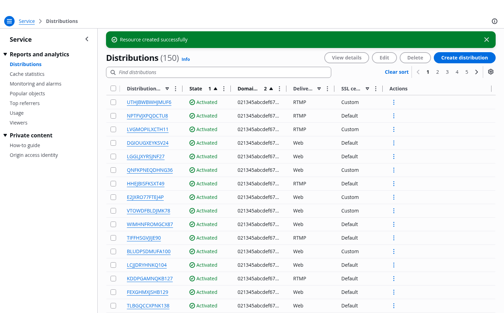
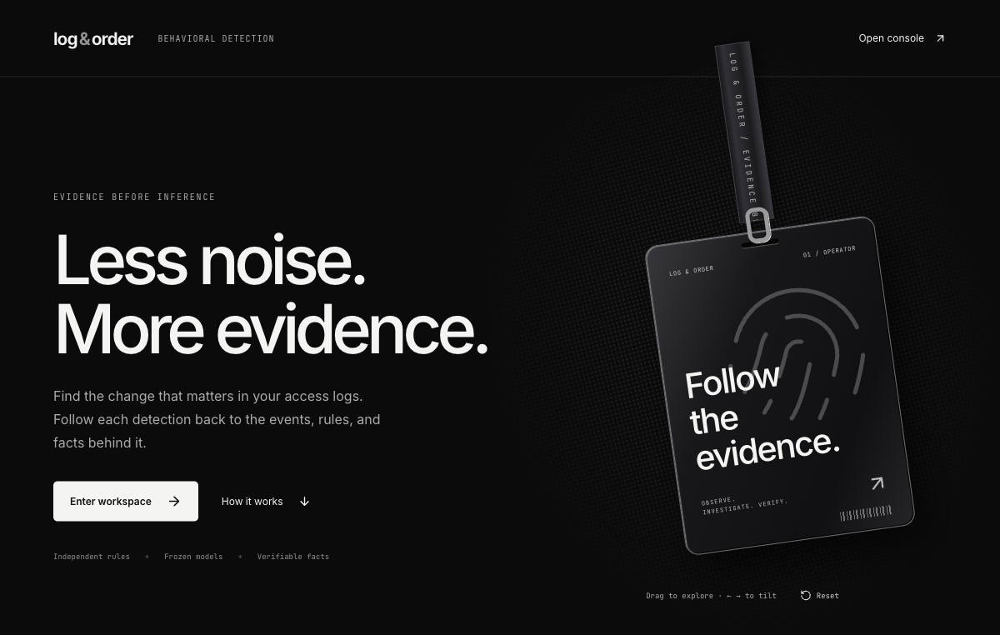

# Log & Order — product design inventory

Research and implementation brief, September 19, 2026. AWS is the primary structural reference. This inventory was established before rewriting the interface. Sources below are public product documentation and design-system examples, not authenticated product sessions. The design-inspiration MCP was queried for AWS references but returned no results. We do not claim to have inspected a paid Mobbin catalog.

## Reference inventory

| Reference | Observed interaction / visual principle | Log & Order application |
| --- | --- | --- |
| [AWS Cloudscape resource management](https://cloudscape.design/patterns/resource-management/) | Resource collections, creation, inspection | Single-level navigation for sources and executions |
| [AWS table view](https://cloudscape.design/patterns/resource-management/view/table-view/) | Resource title, count, primary action, search, stable columns | Sources and execution lists |
| [AWS split view](https://cloudscape.design/patterns/resource-management/view/split-view/) | Keep collection context while inspecting a resource | Event and evidence drawers |
| [AWS resource details](https://cloudscape.design/patterns/resource-management/details/) | Summary metadata followed by related information | Source and execution detail |
| [CloudWatch](https://aws.amazon.com/cloudwatch/) | Sources precede queries and results | Source → execution → event |
| [Datadog log side panel](https://docs.datadoghq.com/logs/explorer/side_panel/) | Context above raw log; links into related resources | Account, source, timestamp, raw evidence, incident pivots |
| [Datadog explorer](https://docs.datadoghq.com/logs/explorer/) | Search/filter before inspection | URL-preserved risk, phase, account filters |
| [Railway observability](https://docs.railway.com/observability) | Explicit execution and service context | Execution selector, status, progress, history |
| [Vercel dashboard](https://vercel.com/blog/dashboard-redesign) | Relevant status and logs visible in resource context | Summary strip, compact detail navigation |
| [Linear navigation](https://linear.app/changelog/2019-12-18-new-command-menu) | Grouped contextual commands | Keyboard palette with pages, resources and execution actions |
| [Kokonut action search](https://kokonutui.com/r/action-search-bar.json) | Icon + label + metadata results, animated transitions | Adapted command surface with cmdk keyboard behavior and Radix focus management |
| [Bklit area chart](https://bklit.com/docs/components/area-chart) | Visx area/line primitives, measured tooltips, subtle reveal | Accessible activity chart with linear interpolation and real timestamp spacing |
| [Motion React](https://motion.dev/docs/react) | Layout animation, drag, reduced motion | Active-navigation indicator, drawer resize, dialog entrance |

### Visual reference

AWS screenshot retained as a reference only; copyright belongs to its owner. Product UI does not embed this image.

## Coherent screen mapping

1. Overview: selected execution summary, time distribution, incidents requiring review, related sources.
2. Sources: searchable resource table; upload dialog; source detail with import status, rejects and related executions.
3. Executions: sortable/filterable history; create in a focused dialog; URL-addressable execution detail.
4. Execution detail: summary metadata, accurate progress, state-dependent controls; Overview / Events / Incidents / Configuration tabs.
5. Event explorer: execution scope → filters → results → resizable detail drawer. Explicit live-following state; historical pagination pauses following.
6. Findings: the event explorer restricted to classified findings. A finding remains an event, not a fabricated backend entity.
7. Incidents: execution-scoped table; detail preserves versioned facts, related episodes, qualified hypotheses, unknowns, feedback and evidence proofs.
8. Analytics: execution-scoped activity and error/risk series; no invented telemetry.
9. Detection: real rule definitions and model artifact availability; configuration is read-only where the backend has no mutation endpoint.
10. Integrations: server-reported connection, preview and disabled states.
11. System: readiness, migration status and configuration fingerprint.
12. Command palette: navigation, source/execution lookup, current execution controls and new execution action.

## Design system

- Inter body and headings; JetBrains Mono only for identifiers, requests and raw logs. Fonts served locally.
- 4px base spacing, 8/12/16/24/32px working scale. 13px body, 12px metadata, 24px page title.
- White surfaces on a cool gray canvas; dark slate global header. Blue denotes actions; red/amber denote measured status only.
- 6–8px surface radius, thin neutral borders, minimal shadow. 44–52px rows. Tables scroll inside their container.
- Flat navigation groups, one detail level; tabs split related tasks without nesting dashboards inside dashboards.
- Hover/focus changes are brief; Motion transitions respect reduced-motion preferences. No decorative metrics or animations.
- Native links for resources; labelled filters, keyboard sorting, focus-trapped dialogs, escape-to-close and focus restoration.
- Filter and selection state in the URL. Loading skeletons, actionable empty states, retryable errors and explicit stale-data messaging.

## Stack and scope

### Additional editorial references — September 19

The user-supplied [IRL template](https://v0.app/templates/v0-irl-event-landing-custom-3d-lanyard-IegtBb6qiEV)
and its [running preview](https://v0-irl-landing-template-is.vercel.app/) were inspected before adding `/welcome`.
The transferable patterns are black/white editorial typography, generous hero spacing, small monospaced metadata,
halftone texture and an interactive lanyard. Our original implementation uses CSS/SVG plus Motion drag and keyboard tilt,
not copied template assets or a WebGL physics simulation. It is lazy-loaded and never competes with investigative tables.

Additional references: [PolyYield](https://polyyield.vercel.app/) (hero hierarchy only, not financial claims),
[Pointer](https://v0.app/templates/pointer-ai-landing-page-XQxxv76lK5w) (typography/breathing room),
[Nexus](https://v0.app/templates/nexus-saas-ai-platform-C8lIjeSzBZr) (product-entry composition).
These do not replace AWS as the operational structure. `/` remains the console; the welcome page is optional and linked from Help.

React 19 + TypeScript + Vite remain the application foundation. Motion is installed. Kokonut's action-search pattern is adapted to this product, with cmdk/Radix providing accessible interaction. Charts follow Bklit's Visx + Motion approach in a deliberately small local component; the entire upstream registry is not vendored. These are adaptations, not claims of unmodified library installation.

Manus is the requested backend hosting target. This frontend keeps same-origin API/SSE contracts and makes the development proxy target configurable. A hosting migration cannot be verified without a Manus project and deployment configuration; no hosting success is implied.

Production checks: typecheck, lint, build; browser workflows for table filtering, command keyboard navigation, creation/upload, detail routes, evidence inspection, mobile layout, API failure and reduced motion. Any fixture-based browser checks must be identified as fixtures, never presented as live backend verification.
